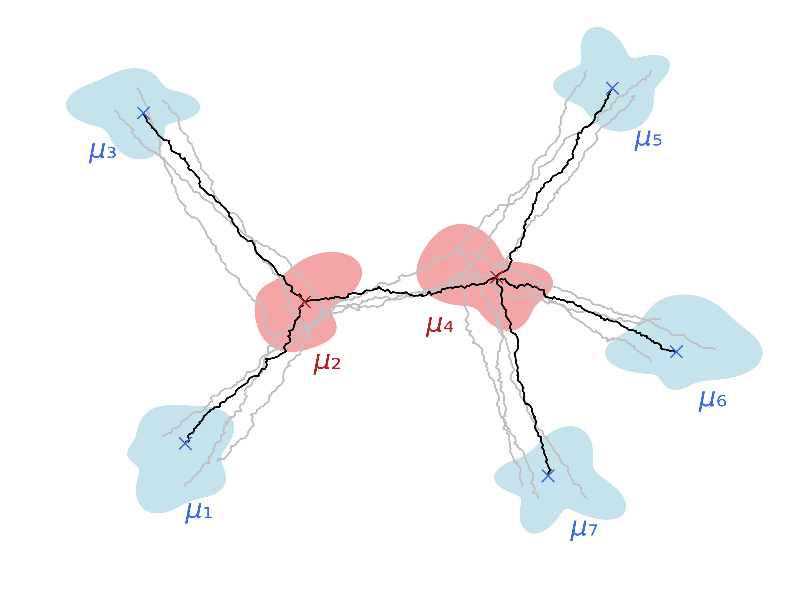
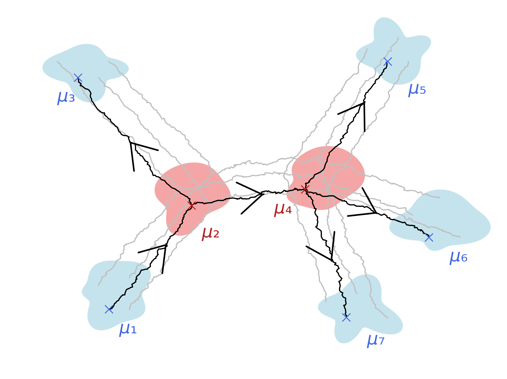

## Schrödinger Bridge Matching for Tree-Structured Costs and Entropic Wasserstein Barycentres

This repository contains code for the preprint https://www.arxiv.org/abs/2506.17197.

  
  

The TreeDSBM algorithm extends fixed-point approaches for barycentre approximation [1] to use flow-based entropic OT solvers, namely the IMF procedure [2]. It proceeds by iteratively constructing stochastic bridges according to the tree-structured framework of [3],[4], and Markovianising the processes along each edge by performing bridge-matching. It provides an IMF counterpart to the IPF approach of [3].

Note: This codebase has been refactored since the original arxiv upload, so results might vary slightly from those reported. The arxiv version will be updated soon.

### References

[1] Álvarez-Esteban et al, 2016, A fixed-point approach to barycenters in Wasserstein space, https://arxiv.org/abs/1511.05355

[2] Shi et al, 2023, Diffusion Schrödinger Bridge Matching, https://arxiv.org/abs/2303.16852

[3] Noble et al, 2023, Tree-Based Diffusion Schrödinger Bridge with Applications to Wasserstein Barycenters, https://arxiv.org/abs/2305.16557

[4] Haasler et al, 2021, Multi-marginal Optimal Transport with a Tree-structured cost and the Schrödinger Bridge Problem, https://arxiv.org/abs/2004.06909

### Citation
If you find our paper or code useful, please consider citing as
<pre><code> @misc{howard2025schrodingerbridgematchingtreestructured,
      title={Schr\"odinger Bridge Matching for Tree-Structured Costs and Entropic Wasserstein Barycentres}, 
      author={Samuel Howard and Peter Potaptchik and George Deligiannidis},
      year={2025},
      eprint={2506.17197},
      archivePrefix={arXiv},
      primaryClass={stat.ML},
      url={https://arxiv.org/abs/2506.17197}, 
} </code></pre>