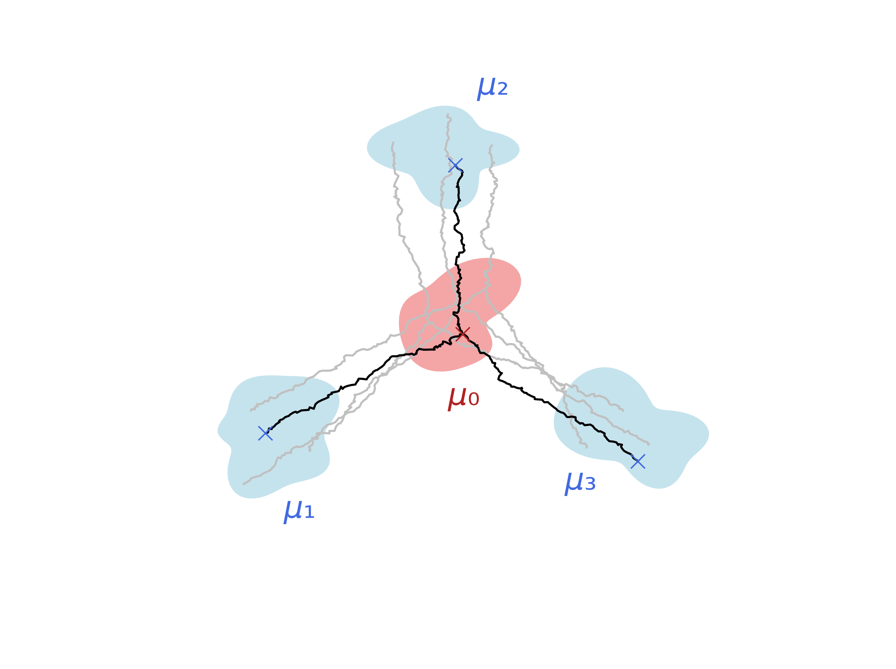
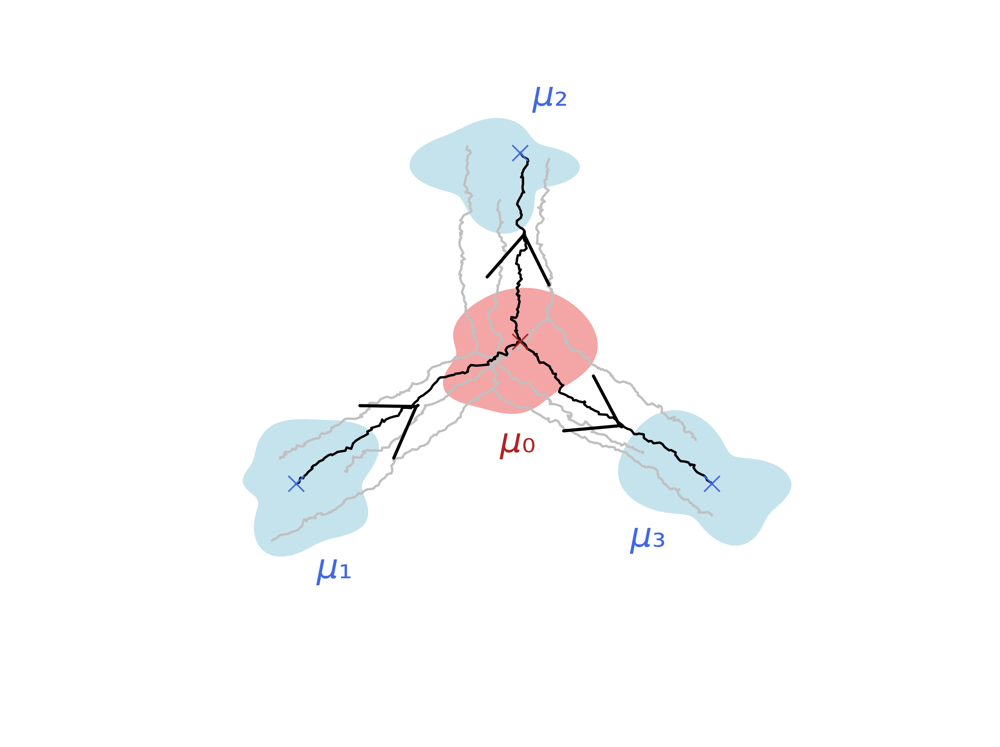

## Schrödinger Bridge Matching for Tree-Structured Costs and Entropic Wasserstein Barycentres

This repository contains code for the NeurIPS 2025 paper https://www.arxiv.org/abs/2506.17197. An accompanying blogpost can be found [here](https://samuelhoward.co.uk/post/imfbarycentres/).

  
  

The TreeDSBM algorithm uses bridge-matching methodology to compute Wasserstein barycentres, and more generally Schrödinger bridge problems defined over tree structures. It provides an efficient iterative method inspired by fixed-point approaches for barycentre computation [1], by extending the IMF procedure [2,3] to the tree-structured Schrödinger bridge framework of [4,5]. The algorithms proceeds by iteratively constructing stochastic bridges according to the tree-structure, and Markovianising the processes along each edge by performing bridge-matching. It provides an IMF counterpart to the IPF approach of [4]. Code to run TreeDSBM in each experimental setting are included as individual notebooks.

### References

[1] Álvarez-Esteban et al, 2016, A fixed-point approach to barycenters in Wasserstein space, https://arxiv.org/abs/1511.05355

[2] Shi et al, 2023, Diffusion Schrödinger Bridge Matching, https://arxiv.org/abs/2303.16852

[3] Peluchetti, 2023, Diffusion Bridge Mixture Transports, Schrödinger Bridge Problems and Generative Modeling, https://arxiv.org/abs/2304.00917

[4] Noble et al, 2023, Tree-Based Diffusion Schrödinger Bridge with Applications to Wasserstein Barycenters, https://arxiv.org/abs/2305.16557

[5] Haasler et al, 2021, Multi-marginal Optimal Transport with a Tree-structured cost and the Schrödinger Bridge Problem, https://arxiv.org/abs/2004.06909

### Citation
If you find our paper or code useful, please consider citing as
<pre><code> @inproceedings{
howard2025schrodinger,
title={Schr\"odinger Bridge Matching for Tree-Structured Costs and Entropic Wasserstein Barycentres},
author={Samuel Howard and Peter Potaptchik and George Deligiannidis},
booktitle={The Thirty-ninth Annual Conference on Neural Information Processing Systems},
year={2025},
url={https://openreview.net/forum?id=DliPKnn6e0}
}  </code></pre>